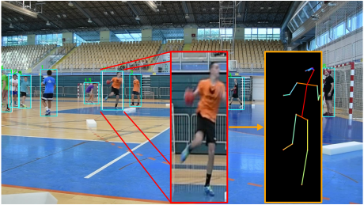
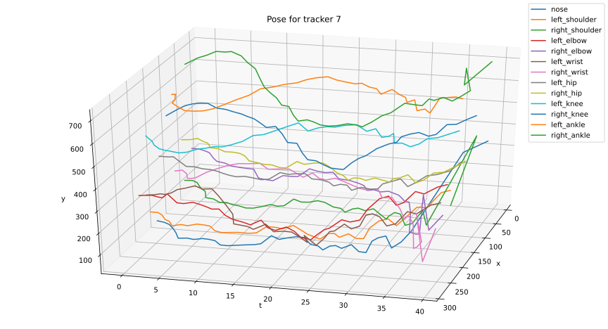
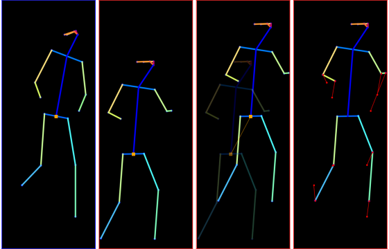

# PoseTracking
 Pose tracking and comparison in the video sequence


## Instalation
```bash
conda create --name pose-tracking python=3.7
conda activate pose-tracking

git clone https://github.com/RomeoSajina/PoseTracking.git

pip install cython; pip install -U 'git+https://github.com/cocodataset/cocoapi.git#subdirectory=PythonAPI'

pip install -U 'git+https://github.com/facebookresearch/fvcore'

pip install torch torchvision

pip install opencv-python-headless

pip install opencv-contrib-python-headless

pip install tensorflow==1.14

pip install scikit_learn

pip install nonechucks==0.3.1

pip install imgaug==0.2.8 --no-dependencies

pip install git+https://github.com/facebookresearch/detectron2.git
```


<br>
<br>

## Pose tracking

Steps in pose tracking:
1. Detect object within an image
2. Apply DeepSORT to track the detected objects
3. Crop and resize the tracked object
4. Run pose estimation on resulted image


#### Detection and tracking
We run object detection and tracking on the video sequence using Faster R-CNN and Deep SORT


#### Pose estimation
For each frame we crop and resize the tracked player to dimenisions 300x800, when a pose estimation is executed



#### Pose tracking
Estimated pose for tracked player is saved, and at the end we can visualize poses across frames



#### Pose alignment
We can compare poses of two different players executing the same action sequence, where we observe the first one as a template and evaluate the second one to find needed correction in order to correctly execute the action


<br>
<br>


## Run on a custom video sequence

#### Pose tracking

Defining a pose tracker for a video in a given path:
```python
from pose_tracker import PoseTracker
pt = PoseTracker(video="my_video.mov")
```


We can run pose tracking for all players in the scene:
```python
pt.run()
```

Or we can run pose tracking for only one specific player, here you need to hit the key _**s**_ to enter **tracker id** of player you wish to track:
```python
pt.select_and_run()
```

Results can be saved and loaded:
```python
pt.save()
pt.load()
```


After running pose tracking we can visualize poses in space across time for a specific player:
```python
pt.pose_visualizer.plot3D(7)
```


#### Pose comparison

We can compare two pose sequences, first, we run or load tracked poses

```python
from pose_tracker import PoseTracker
pt1 = PoseTracker(video="my_video_1.mov")
pt1.load()

pt2 = PoseTracker(video="my_video_2.mov")
pt2.load()
```

Then we need to get the specific pose sequences for a target player from each pose tracker that will be compared
```python
poses_1 = pt.pose_visualizer.poses_for_id(7)
poses_2 = pt2.pose_visualizer.poses_for_id(3)
```

We then compute the distance between the two poses and find the appropriate starting point of the second sequence to match the first one.
**Important** to notice here is that the second sequence must be longer than the first one and the function `find_and_compute_distance` will take care of the rest
```python
from pose_comparator import find_and_compute_distance

poses_1, poses_2, distances = find_and_compute_distance(poses_1, poses_2)

print("Total distance: " + str(np.array(distances).flatten().sum()))
```


Finally, we can visualize the difference (delay represents the number of seconds before continuing to the next pose)
```python
from pose_visualizer import PoseVisualizer
PoseVisualizer.show_sequence(poses_1, poses_2, delay=4)
```


**Final code**
```python
from pose_comparator import find_and_compute_distance
from pose_tracker import PoseTracker
from pose_visualizer import PoseVisualizer

pt1 = PoseTracker(video="my_video_1.mov")
pt1.load()

pt2 = PoseTracker(video="my_video_2.mov")
pt2.load()

poses_1 = pt.pose_visualizer.poses_for_id(7)
poses_2 = pt2.pose_visualizer.poses_for_id(3)

poses_1, poses_2, distances = find_and_compute_distance(poses_1, poses_2)

print("Total distance: " + str(np.array(distances).flatten().sum()))

PoseVisualizer.show_sequence(poses_1, poses_2, delay=4)
```

<br>
<br>


## Training on a custom dataset

#### Creating a custom dataset
Steps:
1. Create images from a video sequence
2. Annotate images with bounding boxes and keypoints
3. Download and fix .json file with annotations


You can clip a video to a specific starting and ending point where you want to extract images to train:
```python
from create_dataset import clip
clip(video="my_video.mov", output_video="my_video_clipped.mov")
```

To create images from a video sequence of a target you can use following:
```python
from create_dataset import create_images
create_images(o_v="my_video_clipped.mov", v_focus_id=7)
```


**Annotation**
After creating images, they need to be annotated. For annotation use .
Download the annotator tool and run it with docker:

```bash
cd coco-annotator
docker-compose up
```

Using command `docker container ls` find the id of the container and copy the generated images:
```bash
cd <name_of_the_dataset_folder>
docker cp . <container_id_with_name_annotation_workers>:/datasets/<name_of_the_dataset_folder>
```

Open the browser on the URL `http://localhost:5000/` and sign in with `admin:admin` to start annotating.


After finishing annotating the images, download the .json file and run the following function:
```python
from create_dataset import fix_exported_json
fix_exported_json(file_name="name_of_the_json_file.json")
```


### Training the model with a new dataset

To train the model with a new dataset, apply needed changes to the `train.py` file. Firstly, change the dataset name if you want:
```python
CUSTOM_DATASET_NAME = "my_custom_dataset"
```

Change path for dataset registration to point on your images and .json file
```python
register_coco_instances(CUSTOM_DATASET_NAME, {}, "name_of_the_json_file.json", "./folder_of_generated_images/full_hd/")
```

**Finally**, you can train your model. After the model is trained it will be placed in the "./output/" folder with a name "model_final.pth"
```python
train()
```

Additionally, you can check if the dataset has loaded correctly
```python
show_random_from_dataset()
```

Also, after training, you can check if the accuracy of the pose estimation has improved on the dataset
```python
predict_random_from_dataset()
```

Additionaly, you can test model performance on the unseen dataset after training
```python
predict_random_from_dataset(custom_dataset=[{"file_name": "./folder_of_generated_images/full_hd/full_hd/5_{0}.png".format(x)} for x in [10, 20, 30, 40, 50, 60, 70, 75]], sample_size=None)
```
