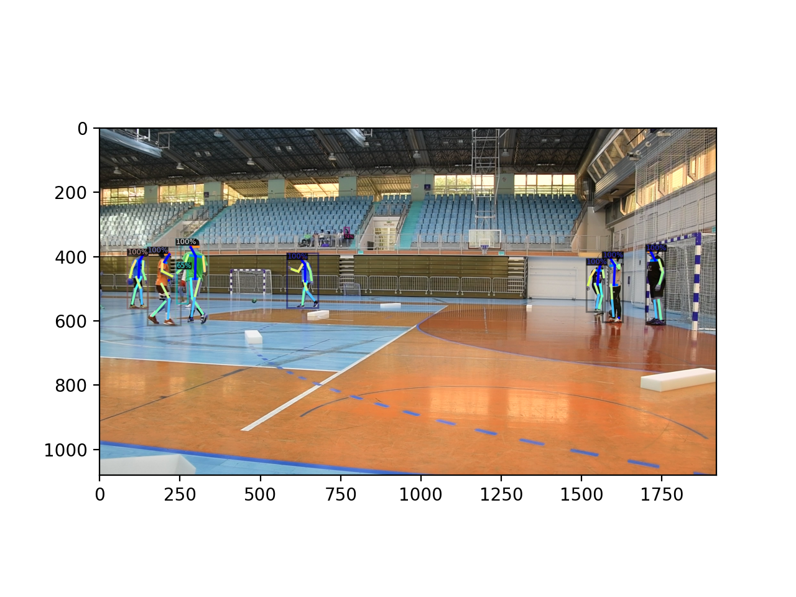
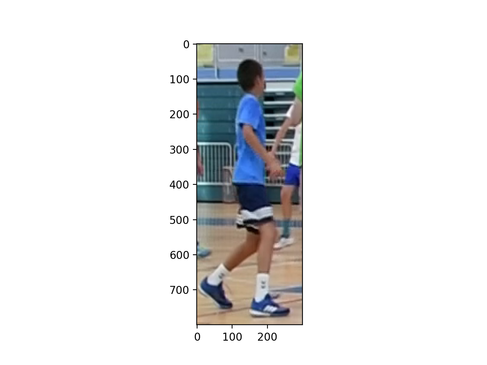
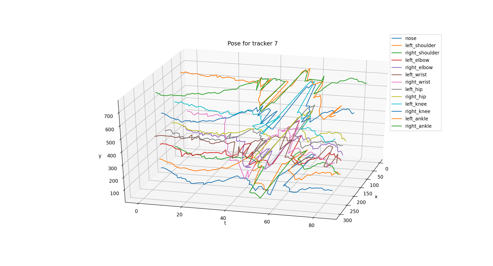

# PoseTracking
 Pose tracking in the videos

### Instalation
- TODO:

### Pose tracking

Steps in pose tracking:
1. Detect object within an image
2. Apply DeepSORT to track the detected objects
3. Crop and resize tracked object
4. Run pose estimation on resulted image

**Detection (note: pose estimation not needed here)**

**Resize tracked object**

**Visualize poses across frames**

